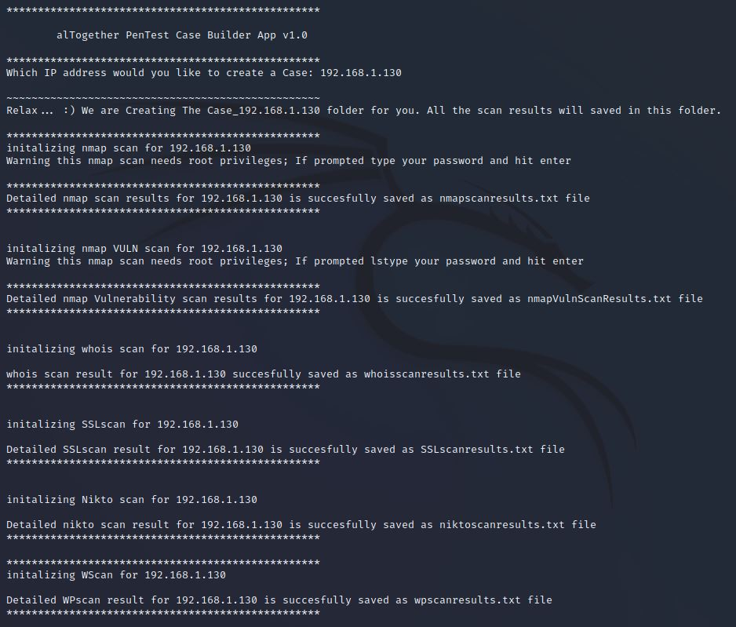

# #***********************************************#

##  alTogether PenTest Case Builder App v1.0

# #***********************************************#

- alTogether app v1.0 by `S3rk4n`  https://github.com/SerkanYildirim-GitHub/alTogether_Scanning_App

 
 

## `All together` vs `alTogether`

### All together means “everyone together” or “everything together.”

### `alTogether means` “completely,” “all things considered,” or “on the whole.”   

### `alTogether` app makes Variety of PenTest Scannings with a user input IP address.! 

 

### Running the Script

Run the code with:
~~~ bash 
python3 alTogether.py <Ip Address> 
~~~ 
or only: 
~~~ bash 
python3 alTogether.py 
~~~ 
Type the IP address when prompted and Relax... 

All the Scans will done automatically. The scan results are saved in to `Case_[IP_address]` Folder.
  

  
 

