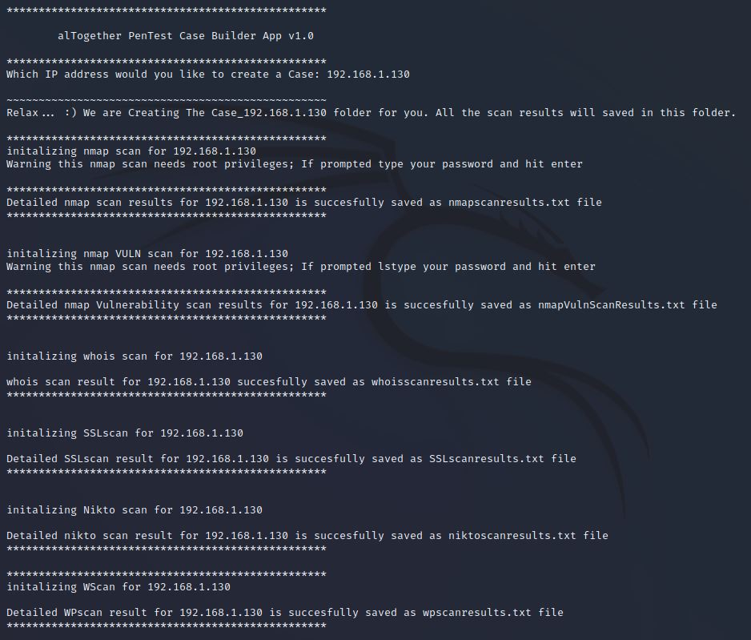
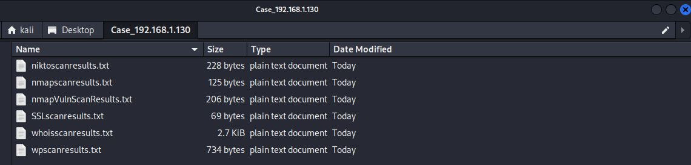

# #***********************************************#

##  alTogether PenTest Case Builder App v1.0

# #***********************************************#
> **Authorized Use Only:** This tool is intended for educational labs and authorized security testing environments.
> Do not run scans against systems you do not own or have explicit permission to assess.
> 
- alTogether app v1.0 by `S3rk4n`  https://github.com/SerkanYildirim-GitHub/alTogether_Scanning_App

# alTogether — Python Security Scanning Case Builder

alTogether is a Python command-line tool that automates authorized security scanning workflows for lab and assessment environments. 
The tool accepts a target IP address, validates the input, creates a dedicated case folder, runs multiple security tools, and saves the results into organized output files.

## Tools Integrated

- Nmap service and script scan
- Nmap vulners vulnerability scan
- WHOIS lookup
- SSLScan
- Nikto web server scan
- WPScan WordPress scan

## Usage

```bash
python3 alTogether.py <target_ip>

### Running the Script

Run the code with:
~~~ bash 
python3 alTogether.py <Ip Address> 
~~~ 
or only: 
~~~ bash 
python3 alTogether.py 
~~~ 
Type the IP address when prompted and Relax... 

All the Scans will done automatically. The scan results are saved in to `Case_[IP_address]` Folder.

<br>

Screenshot: Scanning with `alTogether`.




Screenshot: `Case_[IP_address]` Folder.


  
 


